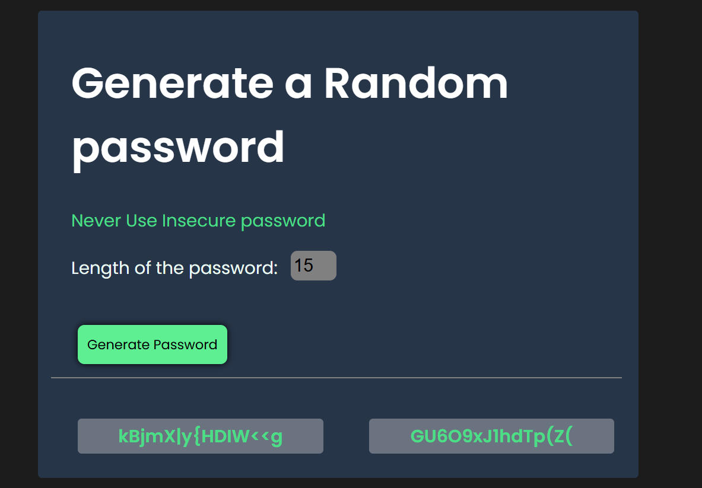

# Password Generator

A simple and secure password generator built with HTML, CSS, and JavaScript. This tool allows you to generate two random passwords of a customizable length between 8 and 15 characters.

## Features:
- **Generate Two Passwords**: Upon clicking the "Generate Password" button, the tool generates two random passwords.
- **Customizable Length**: You can specify the desired password length (between 8 and 15 characters) to suit your needs.
- **Secure Password Generation**: The passwords are generated using a secure set of characters including uppercase and lowercase letters, numbers, and special characters.

## Demo:
You can view the demo of the project 

## Technologies Used:
- **HTML**: For structuring the webpage.
- **CSS**: For styling the page and making it visually appealing.
- **JavaScript**: For generating the random passwords based on the user's input.

## How to Use:
1. Open the `index.html` file in any modern web browser.
2. Enter the desired password length (between 8 and 15 characters) in the input field.
3. Click the "Generate Password" button to generate two random passwords.
4. The generated passwords will appear in the input fields below the button.

password-generator/
│
├── index.html         
├── style.css          
├── index.js           
└── README.md 
